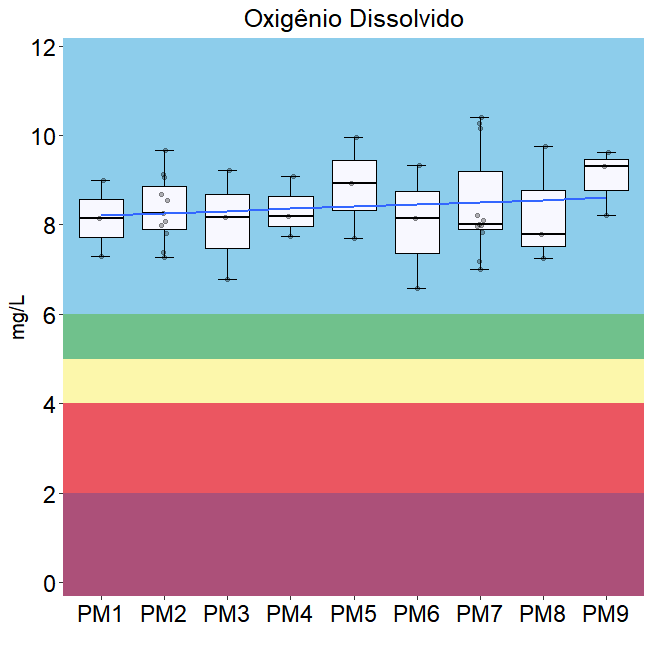
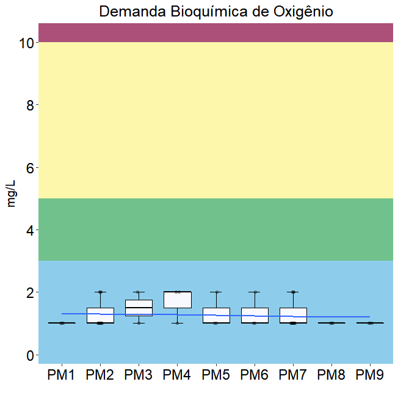
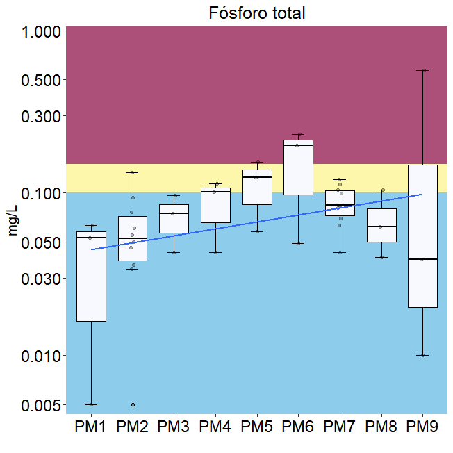
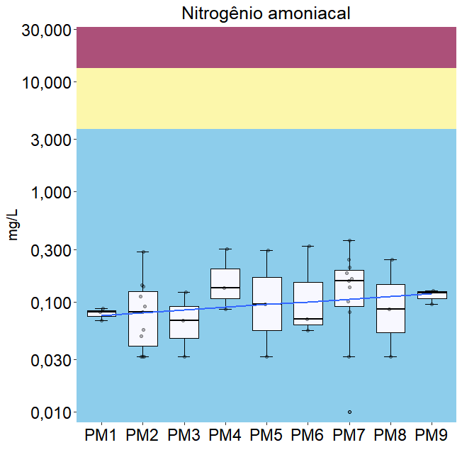
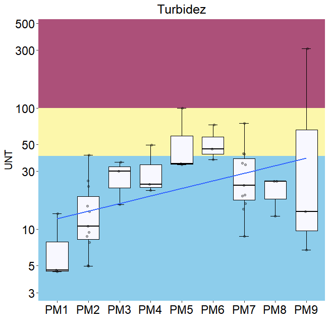
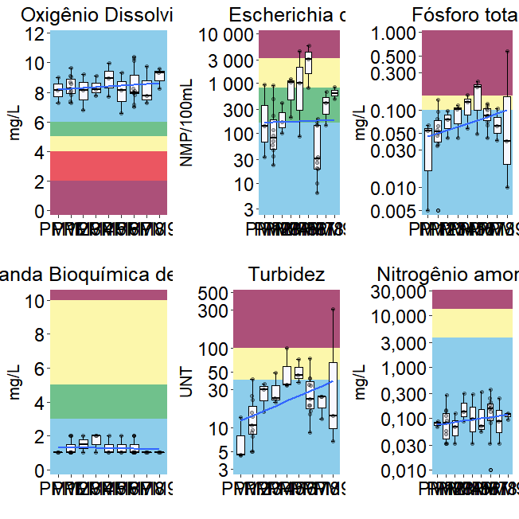
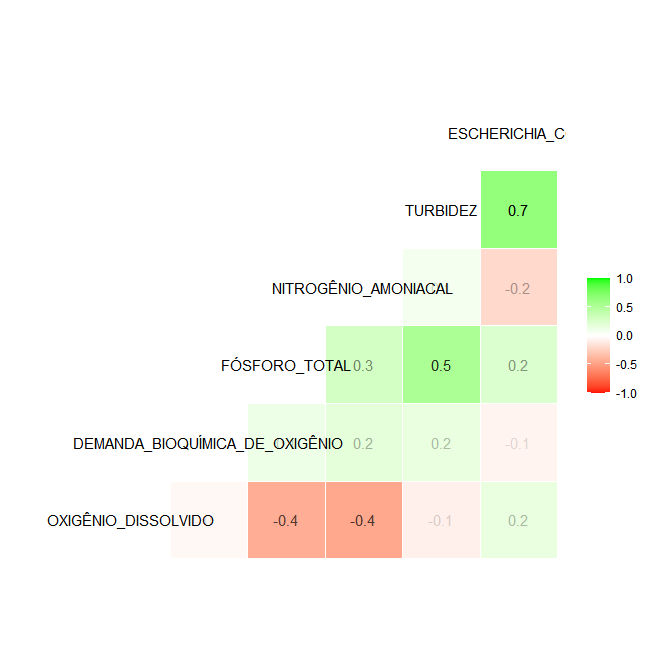

# Importando os pacotes

```r
library(readr)
library(rmarkdown)
library(qboxplot)
library(readxl)
library(pillar)
library(dplyr)
library(tidyverse)
library(gapminder)
library(knitr)
library(kableExtra)
library(ggpubr)
library(gridExtra)
library(modelsummary)
# library(gtsummary)
pacman::p_load(ggbeeswarm)
```

# Importando as planilhas


```r
bj_rsagua <- read_excel("C:/Users/Léo/Desktop/baixo_jacui/bj_rsagua.xls",
    sheet = "Dados_Ajustados", 
    col_types = c("numeric","text", "numeric", "numeric", "text",
                  "text", "text", "text", "text", "date",
                  "date", "text", "numeric", "numeric","numeric", 
                  "numeric", "numeric", "numeric", "numeric", "numeric",
                  "numeric", "numeric", "numeric","numeric", "numeric", 
                  "numeric","numeric", "numeric", "numeric", "numeric", 
                  "numeric", "numeric", "numeric", "numeric", "numeric",
                  "numeric", "numeric", "numeric", "numeric", "numeric", 
                  "numeric", "numeric", "numeric", "numeric", "numeric", 
                  "numeric", "numeric", "numeric", "numeric", "numeric",
                  "numeric"),
    range = "A1:AY44")
```


# Parâmetros físico químicos
## Oxigênio Dissolvido


```r
(od_bj <- ggplot(bj_rsagua,
                 aes(`CÓD. ESTAÇÃO`,
                     `OXIGÊNIO DISSOLVIDO`,
                 )
)+
  annotate("rect",
           xmin = -Inf,
           xmax = Inf,
           ymin = -Inf,
           ymax = 2.0,
           alpha = 1,
           fill = "#ac5079")+ #>pior classe
  annotate("rect",
           xmin = -Inf,
           xmax = Inf,
           ymin = 2,
           ymax = 4,
           alpha = 1,
           fill="#eb5661")+ #classe 4
  annotate("rect",
           xmin = -Inf,
           xmax = Inf,
           ymin = 4,
           ymax = 5,
           alpha = 1,
           fill="#fcf7ab")+ #classe 3
  annotate("rect",
           xmin = -Inf,
           xmax = Inf,
           ymin = 5,
           ymax = 6,
           alpha = 1,
           fill = "#70c18c")+ #classe 2
  annotate("rect",
           xmin = -Inf,
           xmax = Inf,
           ymin = 6,
           ymax = Inf,
           alpha = 1,
           fill = "#8dcdeb")+ #classe 1
  stat_boxplot(
    geom = 'errorbar',
    width = 0.3,
    position = position_dodge(width = 0.65)
  )+
  geom_boxplot(fill = '#F8F8FF',
               color = "black",
               outlier.shape = 1, #se deixar NA fica só o jitter, se não, deixa 1
               width = 0.7)+
  labs(title = "Oxigênio Dissolvido",
       x = "",
       y = "mg/L")+
  ggbeeswarm::geom_quasirandom(
    size = 1.25,
    alpha = .30,
    width = .07,
  )+
  scale_y_continuous(
    expand = expansion(mult = c(0.03,0.17)),
    n.breaks = 8,
    limits = c(min(0, na.rm = TRUE),
               max(bj_rsagua$`OXIGÊNIO DISSOLVIDO`), na.rm = TRUE)
  )+
  scale_x_discrete(
    limits = c("85400010", "85427100", "85642010", 
               "85651020", "85658000", "85662000", 
               "85930000", "87390060", "87510060"),
    labels = c("PM1", "PM2", "PM3", 
               "PM4", "PM5", "PM6", 
               "PM7", "PM8", "PM9")
    )+
  geom_smooth(method = "lm",
              se=FALSE, #se deixar TRUE gera o intervalo de confiança de 95%
              aes(group=1),
              alpha=.5,
              na.rm = TRUE,
              size = 1)+
# geom_line(
#   aes(color="red"),
#   alpha=.0)+
# scale_color_manual("Legenda",
#                    guide="legend",
#                    values = c("Classe 1"="#8dcdeb",
#                               "Classe 2"="#70c18c",
#                               "Classe 3"="#fcf7ab",
#                               "Classe 4"="#eb5661",
#                               "Pior Classe"="#ac5079"))+
# guides(color=guide_legend(override.aes = list(linetype=c(1,1,1,1,1),
#                                               lwd=c(2,2,2,2,2),
#                                               shape=c(NA,NA,NA,NA,NA),
#                                               alpha=1)))+
theme(
  plot.title = element_text(
    hjust = 0.5,
    color = "black",
    size = 19),
  axis.title.y = element_text(
    color = "black",
    size = 15),
  axis.text.y = element_text(
    color = "black",
    size = 17),
  axis.text.x = element_text(
    color = "black",
    size = 17),
)
)
```

<!-- -->

## Demanda Bioquímica de Oxigênio


```r
(dbo_bj <- ggplot(bj_rsagua,
                  aes(`CÓD. ESTAÇÃO`,
                      `DEMANDA BIOQUÍMICA DE OXIGÊNIO`,
                  )
)+
  annotate("rect",
           xmin=-Inf,
           xmax=Inf,
           ymin=10,
           ymax=Inf,
           alpha=1,
           fill="#ac5079")+ #>pior classe
  annotate("rect",
           xmin=-Inf,
           xmax=Inf,
           ymin=5,
           ymax=10,
           alpha=1,
           fill="#fcf7ab")+ #classe 3
  annotate("rect",
           xmin=-Inf,
           xmax=Inf,
           ymin=3,
           ymax=5,
           alpha=1,
           fill="#70c18c")+ #classe 2
  annotate("rect",
           xmin=-Inf,
           xmax=Inf,
           ymin=-Inf,
           ymax=3,
           alpha=1,
           fill="#8dcdeb")+ #classe 1
  stat_boxplot(geom = 'errorbar',
               width=0.3,
               position = position_dodge(width = 0.65))+
  geom_boxplot(fill='#F8F8FF',
               color="black",
               outlier.shape = 1, #se deixar NA fica só o jitter, se não, deixa 1
               width= 0.7)+
  labs(title = "Demanda Bioquímica de Oxigênio",
       x="",
       y="mg/L")+
 ggbeeswarm::geom_quasirandom(
    size = 1.25,
    alpha = .30,
    width = .07,
  )+
  scale_y_continuous(
    expand = expansion(mult = c(0.03, 0.06)),
    n.breaks = 8,
    limits = c(min(0, na.rm = TRUE),
               max(bj_rsagua$`DEMANDA BIOQUÍMICA DE OXIGÊNIO`), na.rm = TRUE)
    )+
    scale_x_discrete(
    limits = c("85400010", "85427100", "85642010", 
               "85651020", "85658000", "85662000", 
               "85930000", "87390060", "87510060"),
    labels = c("PM1", "PM2", "PM3", 
               "PM4", "PM5", "PM6", 
               "PM7", "PM8", "PM9")
    )+
  geom_smooth(method = "lm",
              se=FALSE, #se deixar TRUE gera o intervalo de confiança de 95%
              aes(group=1),
              alpha=.5,
              na.rm = TRUE,
              size = 1)+
  #   geom_line(aes(color="red"),
  #             alpha=.0)+
  # scale_color_manual("Legenda",
  #                    guide="legend",
  #                    values = c("Pior classe"="#ac5079",
#                               "Classe 3"="#fcf7ab",
#                               "Classe 2"="#70c18c",
#                               "Classe 1"="#8dcdeb"))+
# guides(color=guide_legend(override.aes = list(linetype=c(1,1,1,1),
#                                               lwd=c(2,2,2,2),
#                                               shape=c(NA,NA,NA,NA),
#                                               alpha=1)))+
theme(
  plot.title = element_text(
    hjust = 0.5,
    color = "black",
    size = 19),
  axis.title.y = element_text(
    color = "black",
    size = 15),
  axis.text.y = element_text(
    color = "black",
    size = 17),
  axis.text.x = element_text(
    color = "black",
    size = 17),
)
)
```

<!-- -->


```r
(sum_dbo_bj <- bj_rsagua %>%
   select(`CÓD. ESTAÇÃO`, `DEMANDA BIOQUÍMICA DE OXIGÊNIO`) %>% 
   group_by(`CÓD. ESTAÇÃO`) %>% 
   summarize(
     min = 
       min(`DEMANDA BIOQUÍMICA DE OXIGÊNIO`, 
           na.rm = TRUE),
     q1 = 
       quantile(`DEMANDA BIOQUÍMICA DE OXIGÊNIO`, 0.25, 
                na.rm = TRUE),
     median = 
       median(`DEMANDA BIOQUÍMICA DE OXIGÊNIO`, 
              na.rm = TRUE),
     mean = 
       mean(`DEMANDA BIOQUÍMICA DE OXIGÊNIO`, 
            na.rm= TRUE),
     q3 = 
       quantile(`DEMANDA BIOQUÍMICA DE OXIGÊNIO`, 0.75, 
                na.rm = TRUE),
     max = 
       max(`DEMANDA BIOQUÍMICA DE OXIGÊNIO`, 
           na.rm = TRUE))
)
```

```
## # A tibble: 9 x 7
##   `CÓD. ESTAÇÃO`   min    q1 median  mean    q3   max
##   <chr>          <dbl> <dbl>  <dbl> <dbl> <dbl> <dbl>
## 1 85400010           1  1       1    1     1        1
## 2 85427100           1  1       1    1.27  1.5      2
## 3 85642010           1  1.25    1.5  1.5   1.75     2
## 4 85651020           1  1.5     2    1.67  2        2
## 5 85658000           1  1       1    1.33  1.5      2
## 6 85662000           1  1       1    1.33  1.5      2
## 7 85930000           1  1       1    1.27  1.5      2
## 8 87390060           1  1       1    1     1        1
## 9 87510060           1  1       1    1     1        1
```

## Fósforo total


```r
(ptot_bj<-ggplot(bj_rsagua,
                 aes(`CÓD. ESTAÇÃO`,
                     `FÓSFORO TOTAL`,
                     # fill=`FÓSFORO TOTAL`
                 )
)+
  annotate("rect",
           xmin=-Inf,
           xmax=Inf,
           ymin=0.15,
           ymax=Inf,
           alpha=1,
           fill="#ac5079")+ #>pior classe
  annotate("rect",
           xmin=-Inf,
           xmax=Inf,
           ymin=0.1,
           ymax=0.15,
           alpha=1,
           fill="#fcf7ab")+ #classe 3
  annotate("rect",
           xmin=-Inf,
           xmax=Inf,
           ymin=0,
           ymax=0.1,
           alpha=1,
           fill="#8dcdeb")+ #classe 1
  stat_boxplot(geom = 'errorbar',
               width=0.3,
               position = position_dodge(width = 0.65))+
  geom_boxplot(fill='#F8F8FF',
               color="black",
               outlier.shape = 1, #se deixar NA fica só o jitter, se não, deixa 1
               width= 0.7)+
  labs(title = "Fósforo total",
       x="",
       y="mg/L")+
  # geom_jitter(width = .05,
  #             alpha=.2,
  #             size=1.5,
  #             color="black")+
  ggbeeswarm::geom_quasirandom(
    size = 1.25,
    alpha = .30,
    width = .07,
  )+
  scale_y_continuous(
    expand = expansion(mult = c(0.03,0.13)),
    n.breaks = 8,
    limits = c(min(bj_rsagua$`FÓSFORO TOTAL`, na.rm = TRUE),
               max(bj_rsagua$`FÓSFORO TOTAL`), na.rm = TRUE),
    trans = "log10"
  )+
  scale_x_discrete(
    limits = c("85400010", "85427100", "85642010", 
               "85651020", "85658000", "85662000", 
               "85930000", "87390060", "87510060"),
    labels = c("PM1", "PM2", "PM3", 
               "PM4", "PM5", "PM6", 
               "PM7", "PM8", "PM9")
  )+
  geom_smooth(method = "lm",
              se=FALSE, #se deixar TRUE gera o intervalo de confiança de 95%
              aes(group=1),
              alpha=.5,
              na.rm = TRUE,
              size = 1)+
theme(
  plot.title = element_text(
    hjust = 0.5,
    color = "black",
    size = 19),
  axis.title.y = element_text(
    color = "black",
    size = 15),
  axis.text.y = element_text(
    color = "black",
    size = 17),
  axis.text.x = element_text(
    color = "black",
    size = 17),
)
)
```

<!-- -->

## Escherichia coli


## Nitrogênio amoniacal


```r
(namon_bj <- ggplot(bj_rsagua,
                    aes(`CÓD. ESTAÇÃO`,
                        `NITROGÊNIO AMONIACAL`,
                        # fill = `NITROGÊNIO AMONIACAL`
                        )
                    )+
   annotate("rect",
            xmin=-Inf,
            xmax=Inf,
            ymin=0,
            ymax=3.7,
            alpha=1,
            fill="#8dcdeb")+ #classe 1
   annotate("rect",
            xmin=-Inf,
            xmax=Inf,
            ymin=13.3,
            ymax=Inf,
            alpha=1,
            fill="#ac5079")+ #>pior classe
   annotate("rect",
            xmin=-Inf,
            xmax=Inf,
            ymin=3.7,
            ymax=13.3,
            alpha=1,
            fill="#fcf7ab")+ #classe 3
   stat_boxplot(geom = 'errorbar',
                width=0.3,
                position = position_dodge(width = 0.65))+
   geom_boxplot(fill='#F8F8FF',
                color="black",
                outlier.shape = 1, #se deixar NA fica só o jitter, se não, deixa 1
                width= 0.7)+
   labs(title = "Nitrogênio amoniacal",
        x="",
        y="mg/L")+
 ggbeeswarm::geom_quasirandom(
    size = 1.25,
    alpha = .30,
    width = .07,
  )+
   scale_y_continuous(expand = expansion(mult = c(0.03, 0.1)),
                      n.breaks = 9,
                      limits = c(min(bj_rsagua$`NITROGÊNIO AMONIACAL`, na.rm = TRUE),
                                 max(15, na.rm = TRUE)),
                      trans = "log10",
                      labels = scales::number_format(accuracy = .001,
                                                     decimal.mark = ",",
                                                     big.mark = " "))+
   scale_x_discrete(
    limits = c("85400010", "85427100", "85642010", 
               "85651020", "85658000", "85662000", 
               "85930000", "87390060", "87510060"),
    labels = c("PM1", "PM2", "PM3", 
               "PM4", "PM5", "PM6", 
               "PM7", "PM8", "PM9")
  )+
   geom_smooth(method = "lm",
               se=FALSE, #se deixar TRUE gera o intervalo de confiança de 95%
               aes(group=1),
               alpha=.5,
               na.rm = TRUE,
               size = 1)+
   # geom_line(aes(color="red"),
   #           alpha=.0)+
   # scale_color_manual("Legenda",
   #                    guide="legend",
   #                    values = c("Pior Classe"="#ac5079",
 #                               "Classe 3"="#fcf7ab",
 #                               "Classe 1"="#8dcdeb"))+
 # guides(color=guide_legend(override.aes = list(linetype=c(1,1,1),
 #                                               lwd=c(2,2,2),
 #                                               shape=c(NA,NA,NA),
 #                                               alpha=1)))+
theme(
  plot.title = element_text(
    hjust = 0.5,
    color = "black",
    size = 19),
  axis.title.y = element_text(
    color = "black",
    size = 15),
  axis.text.y = element_text(
    color = "black",
    size = 17),
  axis.text.x = element_text(
    color = "black",
    size = 17),
)
)
```

<!-- -->

## Turbidez

```r
(turb_bj <- ggplot(bj_rsagua,
                    aes(`CÓD. ESTAÇÃO`,
                        TURBIDEZ,
                    )
                   )+
   annotate("rect",
            xmin=-Inf,
            xmax=Inf,
            ymin=100,
            ymax=Inf,
            alpha=1,
            fill="#ac5079")+ #>pior classe
   annotate("rect",
            xmin=-Inf,
            xmax=Inf,
            ymin=40,
            ymax=100,
            alpha=1,
            fill="#fcf7ab")+ #classe 3
   annotate("rect",
            xmin=-Inf,
            xmax=Inf,
            ymin=0,
            ymax=40,
            alpha=1,
            fill="#8dcdeb")+ #classe 1
   stat_boxplot(geom = 'errorbar',
                width=0.3,
                position = position_dodge(width = 0.65))+
   geom_boxplot(fill='#F8F8FF',
                color="black",
                outlier.shape = 1, #se deixar NA fica só o jitter, se não, deixa 1
                width= 0.7)+
   labs(title = "Turbidez",
        x="",
        y="UNT")+
 ggbeeswarm::geom_quasirandom(
    size = 1.25,
    alpha = .30,
    width = .07,
    na.rm = TRUE
  )+
    scale_y_continuous(expand = expansion(mult = c(0.13, 0.13)),
                      n.breaks = 8,
                  limits = c(min(bj_rsagua$TURBIDEZ, na.rm = TRUE),
                             max(bj_rsagua$TURBIDEZ, na.rm = TRUE)),
                      trans = "log10",
                      labels = scales::number_format(accuracy = 1,
                                                     decimal.mark = ",",
                                                     big.mark = " "))+
   scale_x_discrete(
    limits = c("85400010", "85427100", "85642010", 
               "85651020", "85658000", "85662000", 
               "85930000", "87390060", "87510060"),
    labels = c("PM1", "PM2", "PM3", 
               "PM4", "PM5", "PM6", 
               "PM7", "PM8", "PM9")
  )+
   geom_smooth(method = "lm",
               se=FALSE, #se deixar TRUE gera o intervalo de confiança de 95%
               aes(group=1),
               alpha=.5,
               na.rm = TRUE,
               size = 1)+
   # geom_line(aes(color="red"),
   #           alpha=.0)+
   # scale_color_manual("Legenda",
   #                    guide="legend",
   #                    values = c("Pior Classe"="#ac5079",
   #                               "Classe 3"="#fcf7ab",
   #                               "Classe 1"="#8dcdeb"))+
   # guides(color=guide_legend(override.aes = list(linetype=c(1,1,1),
   #                                               lwd=c(2,2,2),
   #                                               shape=c(NA,NA,NA),
   #                                               alpha=1)))+
theme(
  plot.title = element_text(
    hjust = 0.5,
    color = "black",
    size = 19),
  axis.title.y = element_text(
    color = "black",
    size = 15),
  axis.text.y = element_text(
    color = "black",
    size = 17),
  axis.text.x = element_text(
    color = "black",
    size = 17),
)
)
```

<!-- -->

# Sumários estatísticos

```r
bj_rsagua %>% 
  select(`CÓD. ESTAÇÃO`, `OXIGÊNIO DISSOLVIDO`) %>% 
  group_by(`CÓD. ESTAÇÃO`) %>% 
  summarize(
    max = 
      max(`OXIGÊNIO DISSOLVIDO`, na.rm = TRUE), 
    
    q3 = 
      quantile(`OXIGÊNIO DISSOLVIDO`, 0.75, na.rm = TRUE),
    
    median = 
      median(`OXIGÊNIO DISSOLVIDO`, na.rm = TRUE),
    
    mean = 
      mean(`OXIGÊNIO DISSOLVIDO`, na.rm= TRUE),
    
    q1 = 
      quantile(`OXIGÊNIO DISSOLVIDO`, 0.25, na.rm = TRUE),
    
    min = 
      min(`OXIGÊNIO DISSOLVIDO`, na.rm = TRUE)
    ) %>% 
  pivot_longer(!`CÓD. ESTAÇÃO`,
               names_to = "par",
               values_to = "valor"
  ) %>% 
  pivot_wider(names_from = `CÓD. ESTAÇÃO`,
              values_from = valor)
```

```
## # A tibble: 6 x 10
##   par    85400~1 85427~2 85642~3 85651~4 85658~5 85662~6 85930~7 87390~8 87510~9
##   <chr>    <dbl>   <dbl>   <dbl>   <dbl>   <dbl>   <dbl>   <dbl>   <dbl>   <dbl>
## 1 max       8.99    9.67    9.22    9.09    9.96    9.34   10.4     9.75    9.61
## 2 q3        8.57    8.86    8.69    8.64    9.44    8.75    9.18    8.76    9.46
## 3 median    8.14    8.25    8.16    8.19    8.93    8.15    8       7.78    9.3 
## 4 mean      8.14    8.35    8.06    8.34    8.86    8.02    8.47    8.26    9.04
## 5 q1        7.72    7.90    7.48    7.97    8.32    7.36    7.9     7.52    8.76
## 6 min       7.3     7.26    6.79    7.75    7.7     6.58    7.01    7.25    8.22
## # ... with abbreviated variable names 1: `85400010`, 2: `85427100`,
## #   3: `85642010`, 4: `85651020`, 5: `85658000`, 6: `85662000`, 7: `85930000`,
## #   8: `87390060`, 9: `87510060`
```

```r
# plan_wide_19902020 %>%
#   select(CODIGO, `Oxigênio dissolvido`, ANO_COLETA) %>% 
#   filter(ANO_COLETA>"1990" &
#            ANO_COLETA<="2000") %>% 
#   group_by(CODIGO) %>% 
#   summarize(
#     min = 
#       min(`Oxigênio dissolvido`, na.rm = TRUE),
#     q1 = 
#       quantile(`Oxigênio dissolvido`, 0.25, na.rm = TRUE),
#     median = 
#       median(`Oxigênio dissolvido`, na.rm = TRUE),
#     mean = 
#       mean(`Oxigênio dissolvido`, na.rm= TRUE),
#     q3 = 
#       quantile(`Oxigênio dissolvido`, 0.75, na.rm = TRUE),
#     max = 
#       max(`Oxigênio dissolvido`, na.rm = TRUE))

# plan_wide_19902020 %>%
#   select(CODIGO, `Oxigênio dissolvido`, ANO_COLETA) %>% 
#   filter(ANO_COLETA>"2000" &
#          ANO_COLETA<="2010") %>% 
#   group_by(CODIGO) %>% 
#   summarize(
#     min = 
#       min(`Oxigênio dissolvido`, na.rm = TRUE),
#     q1 = 
#       quantile(`Oxigênio dissolvido`, 0.25, na.rm = TRUE),
#     median = 
#       median(`Oxigênio dissolvido`, na.rm = TRUE),
#     mean = 
#       mean(`Oxigênio dissolvido`, na.rm= TRUE),
#     q3 = 
#       quantile(`Oxigênio dissolvido`, 0.75, na.rm = TRUE),
#     max = 
#       max(`Oxigênio dissolvido`, na.rm = TRUE))
```
      

# Salvando gráficos


```r
todos_par <- grid.arrange(od_bj, ecoli_bj, ptot_bj, 
                          dbo_bj, turb_bj, namon_bj,
                          ncol = 3, nrow = 2)
```

<!-- -->


```r
ggsave("od_bj.png",
       plot = od_bj,
       path = "./graficos",
       dpi = 300,
       type = "cairo")
```

```
## Saving 6.79 x 6.79 in image
```

```
## Warning: Using ragg device as default. Ignoring `type` and `antialias` arguments
```

```
## `geom_smooth()` using formula 'y ~ x'
```

```r
ggsave("dbo_bj.png",
       plot = dbo_bj,
       path = "./graficos",
       dpi = 300,
       type = "cairo")
```

```
## Saving 6.79 x 6.79 in image
```

```
## Warning: Using ragg device as default. Ignoring `type` and `antialias` arguments
```

```
## Warning: Removed 1 rows containing non-finite values (stat_boxplot).
## Removed 1 rows containing non-finite values (stat_boxplot).
```

```
## `geom_smooth()` using formula 'y ~ x'
```

```
## Warning: Removed 1 rows containing missing values (position_quasirandom).
```

```
## Warning in f(...): The default behavior of beeswarm has changed in version
## 0.6.0. In versions <0.6.0, this plot would have been dodged on the y-axis. In
## versions >=0.6.0, grouponX=FALSE must be explicitly set to group on y-axis.
## Please set grouponX=TRUE/FALSE to avoid this warning and ensure proper axis
## choice.
```

```r
ggsave("ptot_bj.png",
       plot = ptot_bj,
       path = "./graficos",
       dpi = 300,
       type = "cairo")
```

```
## Saving 6.79 x 6.79 in image
```

```
## Warning: Using ragg device as default. Ignoring `type` and `antialias` arguments
```

```
## Warning: Transformation introduced infinite values in continuous y-axis
```

```
## Warning: Removed 2 rows containing non-finite values (stat_boxplot).
## Removed 2 rows containing non-finite values (stat_boxplot).
```

```
## `geom_smooth()` using formula 'y ~ x'
```

```
## Warning: Removed 2 rows containing missing values (position_quasirandom).
```

```r
ggsave("ecoli_bj.png",
       plot = ecoli_bj,
       path = "./graficos",
       dpi = 300,
       type = "cairo")
```

```
## Saving 6.79 x 6.79 in image
```

```
## Warning: Using ragg device as default. Ignoring `type` and `antialias` arguments
```

```
## Warning: Transformation introduced infinite values in continuous y-axis
```

```
## Warning: Removed 2 rows containing non-finite values (stat_boxplot).
## Removed 2 rows containing non-finite values (stat_boxplot).
```

```
## `geom_smooth()` using formula 'y ~ x'
```

```
## Warning: Removed 2 rows containing missing values (position_quasirandom).
```

```r
ggsave("namon_bj.png",
       plot = namon_bj,
       path = "./graficos",
       dpi = 300,
       type = "cairo")
```

```
## Saving 6.79 x 6.79 in image
```

```
## Warning: Using ragg device as default. Ignoring `type` and `antialias` arguments
```

```
## Warning: Transformation introduced infinite values in continuous y-axis
```

```
## `geom_smooth()` using formula 'y ~ x'
```

```r
ggsave("turb_bj.png",
       plot = turb_bj,
       path = "./graficos",
       dpi = 300,
       type = "cairo")
```

```
## Saving 6.79 x 6.79 in image
```

```
## Warning: Using ragg device as default. Ignoring `type` and `antialias` arguments
## Transformation introduced infinite values in continuous y-axis
```

```
## `geom_smooth()` using formula 'y ~ x'
```

```r
ggsave("todos_par.png",
       plot = todos_par,
       path = "./graficos",
       dpi = 300,
       type = "cairo",
       scale = 2)
```

```
## Saving 13.6 x 13.6 in image
```

```
## Warning: Using ragg device as default. Ignoring `type` and `antialias` arguments
```

# Correlação

```r
library(GGally)
```

```
## Registered S3 method overwritten by 'GGally':
##   method from   
##   +.gg   ggplot2
```

```r
parametros_correl <- bj_rsagua %>%
  select(`CÓD. ESTAÇÃO`,
         `OXIGÊNIO DISSOLVIDO`,
         `DEMANDA BIOQUÍMICA DE OXIGÊNIO`,
         `FÓSFORO TOTAL`,
         `NITROGÊNIO AMONIACAL`,
         TURBIDEZ,
         `ESCHERICHIA COLI`)

write.csv(parametros_correl,
          "C:\\Users\\Léo\\Desktop\\baixo_jacui\\parametros_correl.csv",
          row.names = FALSE)

parametros_correl %>% 
  select(-`CÓD. ESTAÇÃO`) %>% 
  ggcorr(method = "complete.obs",
         label = TRUE,
         label_alpha = TRUE,
         low = "red",
         mid = "white",
         high = "green",
         # palette = "RdYlBu",
         layout.exp = 1
         )
```

<!-- -->
